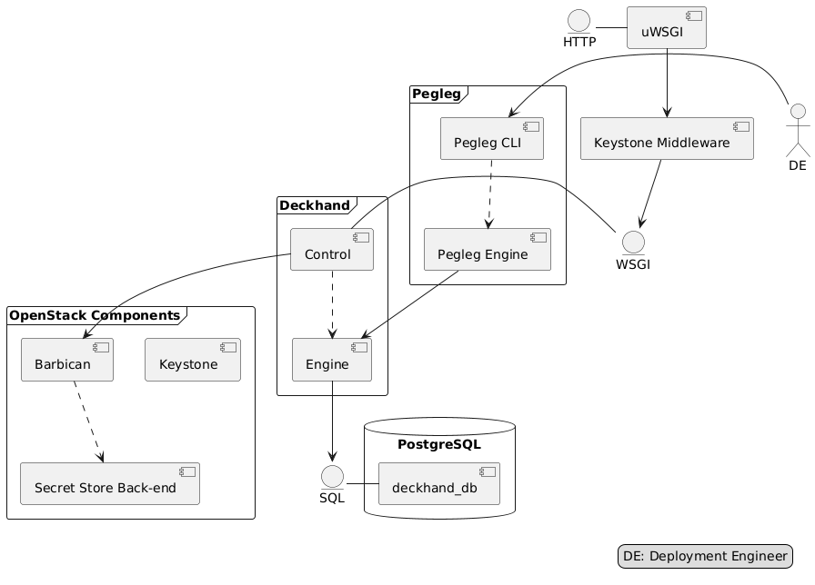

..
      Copyright 2018 AT&T Intellectual Property.
      All Rights Reserved.

      Licensed under the Apache License, Version 2.0 (the "License"); you may
      not use this file except in compliance with the License. You may obtain
      a copy of the License at

          http://www.apache.org/licenses/LICENSE-2.0

      Unless required by applicable law or agreed to in writing, software
      distributed under the License is distributed on an "AS IS" BASIS, WITHOUT
      WARRANTIES OR CONDITIONS OF ANY KIND, either express or implied. See the
      License for the specific language governing permissions and limitations
      under the License.

============================
Developer Overview of Pegleg
============================

Pegleg's core mission is to, alongside Deckhand, facilitate document authoring
strategies within `Airship`_, by:

* aggregating documents across multiple revisioned repositories, each of
  which contains multiple documents defining sites' software and hardware
  stacks
* providing early linting of documents prior to their collection and
  eventual deployment
* including utility functions enabling operators and developers alike to list
  available sites, render individual manifests via `Deckhand`_, bootstrap
  repositories with Pegleg-compliant directory layouts, to name a few

Architecture
============

Pegleg, as a CLI, has a rather simplistic architecture. It is meaningful to
visualize Pegleg alongside Deckhand:

Components
==========

cli
---

The Pegleg ``cli`` module implements the user-facing CLI. For more information
about this module, reference the :ref:`CLI documentation <pegleg-cli>`.

engine
------

The ``engine`` module implements the following functionality:

* document linting
* document rendering via `Deckhand`_
* document aggregation
* additional document utility functions

Developer Workflow
==================

Because Airship is a container-centric platform, the developer workflow heavily
utilizes containers for testing and publishing. It also requires Pegleg to
produce multiple artifacts that are related, but separate: the Python package,
the Docker image and the Helm chart. The code is published via the
Docker image artifact.

Pegleg strives to conform to the `Airship coding conventions`_.

Python
------

The Pegleg code base lives under ``pegleg``. Pegleg supports py35 and py36
interpreters.

Docker
------

The Pegleg Dockerfile is located in ``/images/pegleg`` along with any
artifacts built specifically to enable the container image. Make targets are
used for generating and testing the artifacts.

* ``make images`` - Build the Pegleg Docker image.

Pegleg, as a containerized CLI, uses Docker via ``tools/pegleg.sh`` to
execute CLI commands. Commands can also be executed using the ``Makefile``
target: ``run_pegleg``.

Virtual Environment
-------------------

Rather than, after each local code change, rebuilding the Pegleg image and
overriding the ``IMAGE`` environment variable so ``tools/pegleg.sh`` uses
the latest code changes, it is possible to use a virtual environment for
much faster development.

This can achieved by issuing the following commands (from the root Pegleg
directory):

.. code-block:: console

  # Quick way of building a venv and installing all required dependencies into
  # it.
  tox -e py35 --notest
  source .tox/py35/bin/activate
  pip install -e .

  # Now is it possible to run the Pegleg CLI to test local changes:
  pegleg <command> <options>

  # Or run unit tests:
  pytest -k <regex>

Note that after setting up the virtual environment, one only needs to source it
in order to re-run unit tests or Pegleg CLI commands, to test local changes.

Testing
=======

All Pegleg tests are nested under ``tests``.

Pegleg comes equipped with a number of `tox`_ targets for running unit tests,
as well as `pep8`_ and `Bandit`_ checks.

Unit Tests
----------

To run all unit tests, execute::

  $ tox -epy35

To run unit tests using a regex, execute::

  $ tox -epy35 -- <regex>

.. _Airship: https://airshipit.readthedocs.io
.. _Deckhand: https://airship-deckhand.readthedocs.io/
.. _Airship coding conventions: https://airshipit.readthedocs.io/en/latest/conventions.html
.. _tox: https://tox.readthedocs.io/
.. _pep8: https://www.python.org/dev/peps/pep-0008/
.. _Bandit: https://github.com/PyCQA/bandit
